**Biometrics**

**(BCI3006)**

**Topic:**

**Facial recognition for ATM authentication**

**Slot: B2**

**Group members:**

Aviral Sharma 16BCI0153

Abhijeet Marikal 17BCI0009

*Faculty: Prof USHA K*

**School of Computing Science and Engineering**

# 

# *Contents*

-   CHAPTER-1
    -   Introduction
    -   Problem Definition
    -   Objectives
-   CHAPTER -2
    -   Literature Survey
    -   Table (In DA-1)
-   CHAPTER-3
    -   Proposed System
        -   Architecture
-   CHAPTER-4
    -   Performance Analysis
        -   \-Dataset
            -   \-\>training
            -   \-\>testing

**ACKNOWLEDGEMENT**

In performing our assignment, we had to take the help and guideline of some respected persons, who deserve our greatest gratitude. The completion of this project gives us much pleasure. We would like to show our gratitude **Prof USHA K**, our Biometrics Professor of Vellore Institute of Technology for giving us a good guideline for assignment throughout numerous consultations. We would also like to expand our deepest gratitude to all those who have directly and indirectly guided us in writing this project.

# 

# CHAPTER 1:

# INTRODUCTION

Normally, human beings use faces to distinguish between individuals and current advancements in computer vision capability within the last few years have enabled similar recognitions automatically. Traditional face recognition algorithms used simple geometric models, which have progressively matured over the years into a science of complex mathematical models and representations, thus drawing face recognition technology into the limelight for both verification and identification purposes. Verification is the process of comparing one biometric patterning with another biometric pattern, resulting in either a rejection or acceptance decision, (Heseltine, 2005). Identification is the process of comparing one biometric pattern with a set of two or more biometric patterns in order to determine the most likely match, (Heseltine, 2005).

Authentication in computer information systems has been by tradition based on something that one has for example magnetic strip cards, smart cards or even keys, or what one knows for example usernames and passwords, PIN or other secret codes. In order for more reliability in verification or identification processes to be achieved, something that uniquely identifies and characterizes a given person should be adopted, and biometrics technology offers computerized methods of identity verification using the concept of measurable physiological or behavioral characteristics for instance iris, retinal or face sample. These characteristics are often referred to as bio-data and must be measurable and unique.

This paper presents my findings of facial recognition, a subset of biometric authentication techniques and its deployment possibility in banking applications. Our research work and model will help companies and individuals consider the use of facial recognition as an authentication mechanism in various computer systems and networks.

# ATMs and authentication of ATMs

An ATM is an electronic banking outlet that enables clients to complete basic monetary transactions without the help of a branch representative or teller (Merriam-Webster). Customers are able to perform various banking operations, such as cash withdrawal, deposits, [pay](http://www.businessdictionary.com/definition/pay.html)ment of [bills](http://www.businessdictionary.com/definition/bill.html), [obtain](http://www.businessdictionary.com/definition/obtain.html)ing [bank statements](http://www.businessdictionary.com/definition/bank-statement.html) and effecting cash transfers among other transactions.

ATMs basically cash withdrawal and account's balance statements. The more complex machines will accept deposits; facilitate credit card payments and report account information (Business Dictionary).

# Knowledge: Something only the user knows

In this case, the user is required to prove knowledge of a secret in order to be authenticated. **Password:** A password is an unspaced sequence of characters used to determine that a computer user requesting access to a computer system is really that particular user (Margaret Rouse, 2005). However, there is a growing body of evidence that people cannot cope with the password policies imposed on them (Sasse et al, 1999), and this has posed as the biggest drawback of passwords as a tool of authentication, given the choice users choose the weakest password they can get away with (Herley, 2007).

**PIN:** A numerical code used in many electronic financial transactions (Investopedia). It stands for [Personal Identification Number](http://en.wikipedia.org/wiki/Personal_identification_number) and is typically used in ATMs. PINs are usually used in conjunction with usernames or other passwords. They are also usually required when using bank debit or credit cards, and most banks or financial institutions issue PINs separately from the cards through the mail. However, it has been found to be open to a form of cloning, despite past assurances from banks that chip and pin could not be compromised. 'We've never claimed that chip and pin is 100% secure and the industry has successfully adopted a multi-layered approach to detecting any newly-identified types of fraud‖ ( [Samzenpus](mailto:samzenpus@slashdot.org), 2012)

**Pattern:** Pattern factor is a sequence or array of sets of information as e.g. automatically detectable and processible coding. It is used for authenticating the users e.g. pattern factor-based authentication is used by the bearer presented to a sensor unit to get authenticated by a processing unit.

Security patterns are an agreed upon method to describe best practice solutions for common security problems (Schumacher, 2005).

# Ownership: Something only the user has

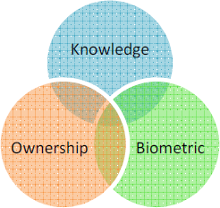A possession may be a physical device given to an authorized user for authentication. Examples include hardware token, USB token or software token.

# Biometrics: Something only the user is

This is the automatic recognition of a person using distinguishing traits (RAND, 2003). Face recognition is among other biometrics including iris recognition, fingerprint, hand print and retina scans.

# Current practices in ATMs

The Procedure to get money from a normal standard ATM can be described as followed:

1.  Customer inserts Card (for identification)
    1.  Customer enters PIN number (for verification)
        1.  ATM sends data to a central bank
        2.  ATM offers access to financial services

            The standard ATM system uses a two-level authentication:

2.  Identification: to identify the customer A one to many

    2 Verification: to ensure that the identified user is using

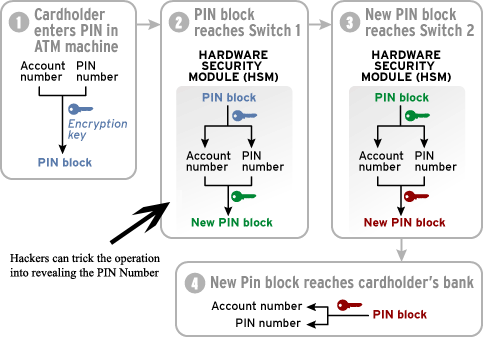

Standard ATM security framework

# A study on the trend of authentication in ATMs

For enterprises that haven't revisited their authentication strategies in several years, it may be time to take a fresh look. According to Gartner Inc., a confluence of technology trends affecting enterprises such as mobility, social media, cloud computing and big data are having an effect on virtually every area of IT, including the market for enterprise authentication technology. It is inevitable to adopt two-factor authentication in one form or another.

# Personal identification number (PIN)

The user is expected to provide a user identifier/token such as a card and a PIN to be authorized to access the system. When the system receives the Client ID and PIN, it compares the stored credentials with the received data. Access is granted only when there is a match between the captured details and the ones stored in the system. PINs are the most often used authentication mechanisms for ATMs.

# PIN Length

At first, Shepherd-Barron envisioned a six-digit PIN number, but his wife nonetheless preferred four digits, which became the standard PIN length for all vending and ATM machines.

# Password

The user presents a valid identity (ID Number) and a password to access the account. A password should be kept secret and should also be short enough to be memorized. They can be digits, letters or alphanumeric codes. The use of passwords is known to be ancient.

# Smart cards

Are defined as any pocket-sized card with embedded integrated circuits which can process information (smartcard alliance, 2009) It has a microchip embedded in it which makes it ―smart‖ and that allows other devices to communicate with it. The processing power of smart cards gives them the versatility needed to make payments, to configure your cell phones and connect to your computers via satellite or the internet (Guthery & Scott, 2001).

# Biometrics

Biometrics offers the best solution for increased security requirements of information systems than passwords, PIN, and cards with PIN number.

Some of the characteristics that make biometrics a better solution includes:

1.  The person to be identified must be physically present during identification,
2.  It averts the need for the person to remember a password, PIN or carry a card.

# Research within password and biometrics authentication in ATMs

It is defined as the development of statistical and mathematical methods applicable to data analysis problems in the biological sciences (Adigun et al, 2014). It may also be referred to the technique for measuring and analyzing a person‘s physiological or behavioral characteristics,such as retina, DNA, fingerprint, gait, face and voice for identification and verification purposes.

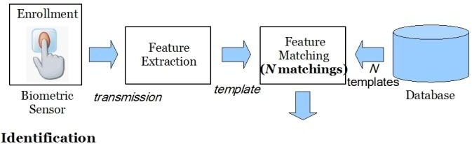

Biometric system (Identification)

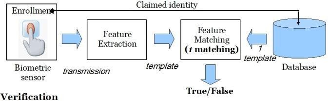

Biometric system (Verification)

This diagram above represents a block diagram of a general biometric system. Several biometric systems networked together with telecommunications technology form a telebiometric system. It is distributed in nature with semi-autonomous terminals that do the identification and verification purposes. These thermals are responsible for both enrolment and test operations. In the enrolment phase, a person\`s biometric information is captured and stored in a database. In the test phase, real-time biometric information is detected, captured and compared with the onestored in the database. It should be noted that the security of the storage and retrieval operations of such systems should be secure especially if the system is to be non-intrusive.

1.  Sensor: it acquires biometric information from a person.
2.  Pre-processor: it performs all the necessary pre-processing i.e. removing noise
3.  Extractor: extracts features from the image.

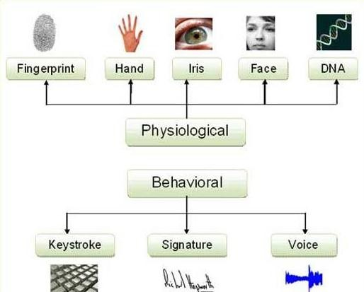

Figure 1.4: Classification of biometrics

Physiological characteristics: relates to the shape of the body e.g.:

1.  Bertillonage: - relates to measuring the body lengths. (it is obsolete);
2.  Finger print: - relates to analyzing fingerprint patterns;
3.  Facial recognition: – relates to measuring face attributes;
4.  Hand geometry: – relates to measuring the shape of the hand;
5.  Iris scan: – deals with analyzing the features of colored ring of the eye;
6.  Retinal scan: – deals with analyzing vein patterns;
7.  DNA – involves analyzing genetic makeup of a human being. Behavioral characteristics: relates to the behavior of a person e.g.:
8.  Voice recognition: – involves analyzing the vocal behavior;
9.  Signature verification: – involves analyzing signature dynamics;
10. Keystroke dynamics: – involves measuring the time spacing of typed words.

# Password

Password is the most used method of restricting access to computer system accounts. Usually, the user presents a valid ID and a password to use the account. Most systems print dots or asterisk instead of the real characters.

Passwords are prone to cracking. This is done by getting a copy of the 1-way hash code in the database, and then using the appropriate algorithm to decode until a match is found.

The most appropriate method of countering password cracking is ensuring that attackers do not even get access to the encrypted password in the server.

# Attaining a Two-factor authentication model

After identification of the requirements and scope of ATM security, we discussed how to integrate our facial recognition component in the ATM architecture.

According to figure 16 above, user plane is the plane that directly interacts with user. Therefore, to meet the user's security objectives, user plane has to provide security services like access control, authentication, data confidentiality and integrity.

# Problem statement

ATM machines face a lot of threats due to the fact that they are public utilities and that there are no measures to control who accesses them at any one point in time. There is lack of a formal model to guarantee security using biometrics technology and to describe secure software system architecture with a stepwise refinement methodology. The methodology for system modelling and refinement specifies a set of architectural and operational components and how they interact with each other.

This is why we are interested in developing a two-factor authentication mechanism using a second factor authentication which is "something that is part of the user".

Human behavioral patterns (gait, handwriting, keystroke, voice, etc) fluctuate due to anxiety, exhaustion, or sickness. However, the physiological methods (retina, face, iris, fingerprint, palm, etc) are more stable than methods in the behavioral category, the reason being that physiological features are often non-alterable except by severe injury and have the benefit of non-intrusiveness. Facial recognition is the primary focus in this study.

# Goal of the study

Use facial recognition technique that will help in the development and training of a learning component which through learning will train an application. Specifically, seeking to use the concept of a learning algorithm to absorb user characteristic features of a face and then use them for authentication. This algorithm will be combined with the face recognition technique to provide non-intrusive security machinery for ATM\`s.

# Objectives

The objectives of this research project are:

-   Carry out a survey of various authentication models for Automated Teller Machines;
-   Design and develop an authentication model that uses two-factors i.e. biometrics and password authentication;
-   Simulate the two-factor model and evaluate its performance;
-   Demonstrate the practicality of the facial recognition component.

# Justification of the study

Application software designers are spending a lot of resources and techniques in trying to develop systems with enhanced security features to prevent access by unauthorized users. Fixing of security loop holes exploited by disgruntled users may take long to be fixed or upgraded with patches. Adding a security feature that allows access based on who you are and that you are who you claim to be will keep off attackers since face recognition is non-intrusive and cannot be fooled by images.

# Scope of the study

This study focuses on the addition of a facial recognition component on top of the PIN-based approach being used in the current ATM system.

**CHAPTER-2**

# LITEREATURE REVIEW

# Introduction

This section will investigate into some of the literature on face recognition. Attempts to automate face recognition began in the 1960s with the initial work of Bledsoe, 1964 even though the first functional implementation of automation of face recognition is owed to Kanade, 1977. Research on automation of face recognition has since then focused on 2 dimensional images with less attention to what 3-dimensional data could offer.

# Background

The attempt to automate face identification using computers is relatively a new concept that is being explored by computer scientists. The first model of facial recognition that semi-automated the process was developed in the 1960s, (Turk et al, 1991) and required the user to locate the principle components including the eyes, nose, mouth and ears on the images and calculating the distances and ratios to a given point of reference, which would then be compared to some predefined data.

Harmon et al, 1970 used specified components such as the eyebrow ridge, the hair color and the thickness of the lips to automatically recognize faces, but encountered the problem of measuring the components and defining their locations because they were calculated manually. This led to the failure of these two early solutions to computerizing facial recognition.

In 1988, Sirovich and Kirby, attempted to use eigenfaces algorithm as an approach to automation with a study of the low-end two-dimensional representation of face images. They showed that PCA could be applied on a set of face images to extract a set of features that could distinctly identify human faces. These features (Eigen pictures) would then be represented linearly to recreate the face images in the initial training set. Assuming that the initial set consists of N images, PCA could form a set of K images, where K \< N. Recreation anomalies could be reduced if the number of eigen pictures were increased putting in mind that their numbers would always be less than K. PCA is a standard linear algebra technique that is used in the automation of facial recognition technique.

At that time (1988), PCA was believed to be a break through because it demonstrated that less than a hundred Eigen pictures from a single face image would accurately be used to code a well reconstructed face image. In 1991 M. Turk and A. Pentland stretched their research and discovered that the residual error from eigenfaces algorithm could be used to identify faces of images from an original set of images. They demonstrated how to represent eigenpictures as eigenvectors of covariance matrix that enabled computers perform Eigen - decomposition on a set of face images.

Unfortunately, the approach was limited by environmental factors such as lighting and complexity of the background, but it did not diminish the interest in furthering the development of automated face recognition technologies. In 2001, the technique drew a historic public attention with the help of the media in Super Bowl. Some of the areas were in field of security, psychology, and image processing, to computer vision. It could capture surveillance images from CCTVs and compare them to a large database of digitalized face images (eigenvectors). This revelation initiated the much-needed research and analysis on how the technology could be used to survey public needs while maintaining a considerable amount of privacy and social secrecy.

Recently, the technique has advanced with the immergence of commercial applications such as TrueFace (1999) and FaceIt (1999).

Over the last fifteen years or so, automation of facial recognition has been an area of research focusing on pattern matching and pattern recognition, image analysis and identification of humans by their characteristics or traits (biometric authentication), (Zou et al., 2006). Facial recognition has also become an area of interest to security personnel and companies. It has been introduced as one of the various methods of identification and verification and was introduced in e-passports in 2004, (ISO, 2004; ANSI, 2004). Today, facial recognition technique is being used to mitigate passport fraud, identify lost children, and reduce benefit fraud.

**Face Recognition Algorithms**

**OpenCV Face Recognizers**

OpenCV has three built in face recognizers and thanks to OpenCV's clean coding, you can use any of them by just changing a single line of code. Below are the names of those face recognizers and their OpenCV calls.

*1. EigenFaces Face Recognizer Recognizer*

*2. FisherFaces Face Recognizer Recognizer*

*3. Local Binary Patterns Histograms (LBPH) Face Recognizer*

**Eigenfaces Face Recognizer:**

This algorithm considers the fact that not all parts of a face are equally important and equally useful. When you look at someone you recognize him/her by his distinct features like eyes, nose, cheeks, forehead and how they vary with respect to each other. So, you are actually focusing on the areas of maximum change (mathematically speaking, this change is variance) of the face. For example, from eyes to nose there is a significant change and same is the case from nose to mouth. When you look at multiple faces you compare them by looking at these parts of the faces because these parts are the most useful and important components of a face. Important because they catch the maximum change among faces, change that helps you differentiate one face from the other. This is exactly how EigenFaces face recognizer works.

Eigenfaces face recognizer looks at all the training images of all the persons as a whole and try to extract the components which are important and useful (the components that catch the maximum variance/change) and discards the rest of the components. This way it not only extracts the important components from the training data but also saves memory by discarding the less important components. These important components it extracts are called **principal components**.

Below is an image showing the principal components extracted from a list of faces.

**Principal Components**

You can see that principal components actually represent faces and these faces are called **eigen faces** and hence the name of the algorithm.

So, this is how Eigenfaces face recognizer trains itself (by extracting principal components). Remember, it also keeps a record of which principal component belongs to which person. One thing to note in above image is that **Eigenfaces algorithm also considers illumination as an important component**.

Later during recognition, when you feed a new image to the algorithm, it repeats the same process on that image as well. It extracts the principal component from that new image and compares that component with the list of components it stored during training and finds the component with the best match and returns the person label associated with that best match component.

Easy peasy, right? Next one is even easier than this one.

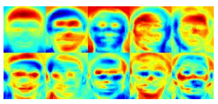

**FisherFaces Face Recognizer:**

This algorithm is an improved version of EigenFaces face recognizer. Eigenfaces face recognizer looks at all the training faces of all the persons at once and finds principal components from all of them combined. By capturing principal components from all of faces combined you are not focusing on the features that discriminate one person from the other but the features that represent all the faces of all the persons in the training data as a whole.

This approach has a drawback. For example, consider the illumination changes in following faces.

You realize that the EigenFaces face recognizer likewise thinks about brightening as a critical part, correct? So, envision a situation in which every one of the essences of one individual has high illuminiation changes (extremely dim or actually light and so forth.). EigenFaces face recognizer will consider those enlightenment changes exceptionally helpful highlights and may dispose of the highlights of the other people's appearances thinking of them as less valuable. Presently the highlights EigenFaces has separated speak to only one individual's facial highlights and not every one of the people's facial highlights.

How to fix this? We can fix this by tunning EigenFaces face recognizer so it extricates valuable highlights from appearances of every individual independently as opposed to separating helpful highlights of the considerable number of countenances consolidated. Thusly, regardless of whether one individual has high brightening changes it won't influence different people highlights extraction process. This is actually what FisherFaces face recognizer calculation does.

Fisherfaces calculation, rather than separating helpful highlights that speak to every one of the essences of the considerable number of people, it extricates valuable highlights that segregate one individual from the others. Along these lines highlights of one individual don't rule (thought about progressively helpful highlights) over the others and you have the highlights that segregate one individual from the others.

Below is an image of features extracted using Fisherfaces algorithm.

**Fisher Faces:**

You can see that features extracted actually represent faces and these faces are called fisher faces and hence the name of the algorithm.

One thing to note here is that Fisherfaces face recognizer only prevents features of one person from dominating over features of the other persons but it still considers illumination changes as useful features. We know that illumination change is not a useful feature to extract as it is not part of the actual face. Then, wow to get rid of this illumination problem? This is where our next face recognizer comes in.

**Local Binary Patterns Histograms (LBPH) Face Recognizer:**

We know that Eigenfaces and Fisherfaces are both affected by light and in real life we can't guarantee perfect light conditions. LBPH face recognizer is an improvement to overcome this drawback.

Idea is to not look at the image as a whole instead find the local features of an image. LBPH alogrithm try to find the local structure of an image and it does that by comparing each pixel with its neighboring pixels.

Take a 3x3 window and move it one image, at each move (each local part of an image), compare the pixel at the center with its neighbor pixels. The neighbors with intensity value less than or equal to center pixel are denoted by 1 and others by 0. Then you read these 0/1 values under 3x3 window in a clockwise order and you will have a binary pattern like 11100011 and this pattern is local to a specific area of the image. You do this on whole image and you will have a list of local binary patterns.

**COMPARISON TABLE:**

| **CRITERIA**                        | **EIGEN FACE**  | **FISHER FACE**        | **LBPH**     |
|-------------------------------------|-----------------|------------------------|--------------|
| **Confidence Factor**               | 2000-3000       | 100-400                | 2-5          |
| **Threshold**                       | 4000            | 400                    | 7            |
| **Principle of dataset generation** | Component based | Component based        | Pixel based  |
| **Basic principle**                 | PCA             | LDA                    | Histogram    |
| **Background noise**                | Maximum         | Medium                 | Minimum      |
| **Efficiency**                      | Low             | Higher than eigenface  | highest      |

**Proposed System Architecture**

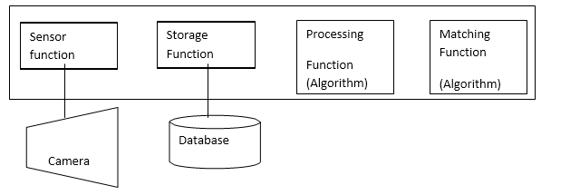

# Face Recognition with OpenCV and Python BASIC STEPS

What is face recognition? Or what is recognition? When you look at an apple fruit, your mind immediately tells you that this is an apple fruit.

This process, your mind telling you that this is an apple fruit is recognition in simple words. So what is face recognition then?

Be that as it may, the genuine inquiry is how does confront acknowledgment functions? It is very straightforward and natural. Take a genuine model, when you meet somebody first time in your life you don't remember him, isn't that so?

While he talks or shakes hands with you, you see his face, eyes, nose, mouth, shading and generally speaking look. This is your mind learning or preparing for the face acknowledgment of that individual by social affair face information. At that point he discloses to you that his name is Paulo. Now your mind realizes that the face information it simply learned has a place with Paulo. Presently your brain is prepared and prepared to do confront acknowledgment all over. Next time when you will see Paulo or his face in an image you will promptly remember him. This is the manner by which face acknowledgment work. The more you will meet Paulo, the more information your mind will gather about Paulo and particularly his face and the better you will move toward becoming at remembering him.

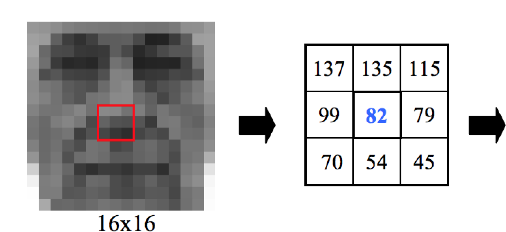

Presently the following inquiry is how to code face acknowledgment with OpenCV, after this is the main motivation behind why you are perusing this article, isn't that so? Alright at that point. You may state that our brain can do these things effectively however to really code them into a PC is troublesome? Try not to stress, it isn't. On account of OpenCV, coding face acknowledgment is as simpler as it feels. The coding ventures for face acknowledgment are same as we talked about it, in actuality, model above.

**Training Data Gathering:** Gather face data (face images in this case) of the persons you want to recognize

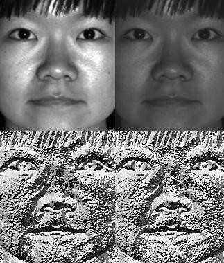**Training of Recognizer:** Feed that face data (and respective names of each face) to the face recognizer so that it can learn.

**Recognition:** Feed new faces of the persons and see if the face recognizer you just trained recognizes them.

OpenCV comes equipped with built in face recognizer, all you have to do is feed it the face data. It's that simple and this how it will look once we are done coding it.

# LBP Faces

**Coding Face Recognition with OpenCV**

The Face Recognition process in this tutorial is divided into three steps.

1.  **Prepare training data:** In this step we will read training images for each person/subject along with their labels, detect faces from each image and assign each detected face an integer label of the person it belongs to.
2.  **Train Face Recognizer:** In this step we will train OpenCV's LBPH face recognizer by feeding it the data we prepared in step 1.
3.  **Testing:** In this step we will pass some test images to face recognizer and see if it predicts them correctly.

To detect faces, I will use the code from my previous article on [face detection](https://www.superdatascience.com/opencv-face-detection/)[.](https://www.superdatascience.com/opencv-face-detection/) So, if you have not read it, I encourage you to do so to understand how face detection works and its Python coding.

# CHAPTER 4

**IMPLEMENTATION, RESULTS & DISCUSSION**

Our research covered four areas. In our first experiment, we explored the role of edges of a face in face recognition. We demonstrated that the performance of face recognition is drastically affected if only the edges of a face are presented for processing. In our second experiment, we looked at holistic and independent processing of facial features. Our third experiment explored the relationship between the width and height dimensions of a face image while our fourth experiment focused on effects of vertical inversion of images on both human vision and computer recognition. The specific experiments and results for each study have been described below.

**Examining the role of edges of a face in face recognition**

# Experiment 1 examines the role of edges and the outline of a human face in face recognition. We found out that edge-maps are a powerful initial representation for visual inputs. According to Richard Russell et al, 2005, they ―capture the most important aspects of images, while being largely invariant to shallow shading gradients that are often the result of illumination variations‖. Line-drawings are sufficiently recognized by human vision with quick pen portraits being often highly recognizable. Such images have a relatively high spatial frequency enough for facial recognition. They possess considerable contour information for defining luminance relations. Bruce et al, 1998 argued that these depictions possess photometric cues and contours that embody face‘s photometric structure. Pearson and Robinson, 1985 convincingly argued that such inclusions make human-generated line drawings better recognizable than computer-generated images.

# 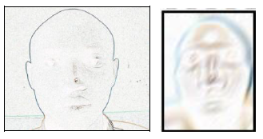

Face images containing contour information may be difficult to recognize.

**Authentication mechanisms chart**

Facial scan is among other effective biometric indicators for human recognition. Different biometric technologies have been used in different identification application systems due to their variations in accuracy, ease of sensing, cost and intrusiveness. Among the 6 biometric technologies considered in this research study, facial recognition got the highest compatibility as shown in the figure below, in an Automated Teller machine based on a number of evaluation factors.

Each biometric indicator has its own unique proper ties, which means that each of them must be addressed independently when evaluating test results and selecting the most appropriate approach for a particular application. The most current evaluations of face recognition technology took place between September 1996 and March 1997 with the Feret (P.J. Phillips et al, 1998).

**Receiver Operating Charactristic**

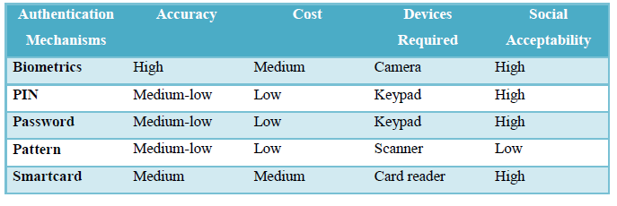In general, the matching algorithm performs a decision using some parameters (e.g. a threshold). The ROC plot is obtained by graphing the values of FAR and FRR, changing the variable simplicity.

**Method of integration**

Vertical Integration was preferred and involves integration of subsystems (modules) according to their functionality and position in the software architecture. The benefit of this method is that the integration is performed quickly and involves only the necessary subsystems.

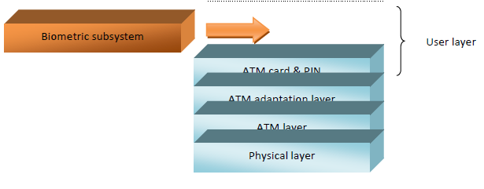Excellent software design approaches minimize the pairing between various components and maximize each component internal consistency with other subsystems. These designs are called 53 modular and they promote the ability to develop, change, and refine individual piecesindependently (Melanchuk, 2012). Independence between them shortens software development time and also reduces the total cost of supporting and maintaining the entire product.

**Performance Evaluation:**

Our main objective in conducting this study is to determine whether experimental design and two-factor authentication modeling can be used in evaluating the performance of a facial recognition system, while still considering varying conditions during enrolment and probe-image and template matching. The table below shows the effects of illumination and the time between capturing each image and their effect on face recognition performance.

**facial recognition verification performance**

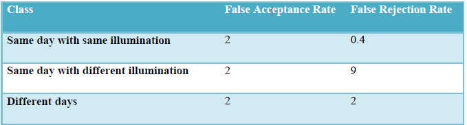

The head pose (pose angle), source of illumination, occlusion and image quality and resolution are our parameters in this set of experiments.

**Factors of Evaluation**

False accept rate (FAR), is a statistic used to measure biometric performance when performing the verification task. The percentage of times a face recognition algorithm, technology, or system falsely accepts an incorrect claim to existence or non-existence of a candidate in the database over all comparisons between a probe and gallery image. (Lucas D., 2006) The false rejection rate, or FRR, is the measure of the likelihood that the biometric security system will incorrectly reject an access attempt by an authorized user. A system's FRR typically 54 is stated as the ratio of the number of false rejections divided by the number of identification attempts. (Webopedia) The false rejection rate (FRR) is calculated as the percentage of scores from the same people that were classified as rejections. The false acceptance rate (FAR) is calculated as the percentage of scores from different people that were classified as acceptances (David Heseltine, 2005). Relative Operating Characteristic (ROC):

In general, the matching algorithm performs a decision using some parameters (e.g. a threshold). The ROC plot is obtained by graphing the values of FAR and FRR, changing the variable simplicity. (Adegun et al, 2014). Equal Error Rate (EER) describes the point at which genuine and imposter error rates are closest to zero. EER can be represented as a percentage with time/unit factors. It can be helpful as a first-order performance indicator for 1:1 verification system. (USMA, 2012) Failure to Capture Rate (FTC): Within automatic systems, the probability that the system fails to detect a biometric characteristic when presented correctly is generally treated as FTC (Adegun et al, 2014). Template Capacity: It is defined as the maximum number of sets of data which can be input into the system (Adegun et al, 2014).

**SAMPLE CODE**

****

**OUTPUTS:**

**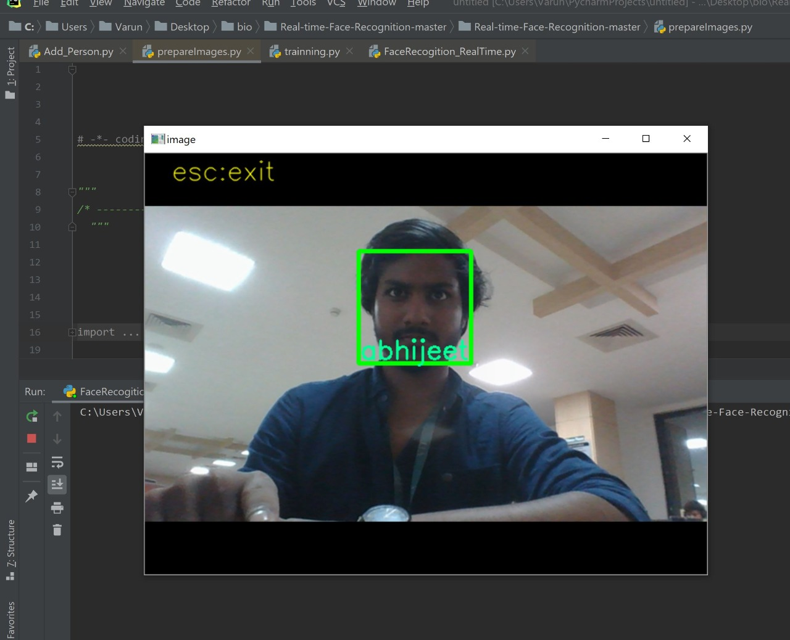**

**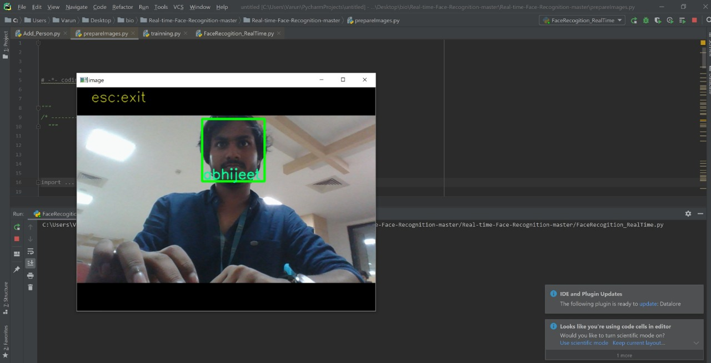**

**Experimental Results**

We conduct experiments on the probe face images and stored data sets. For the experiment on the stored images, we select 89 test identities which are exclusive to our identity data set. We indiscriminately select 11 mutually exclusive persons, against a database consisting of 150 images. The test task is to tell whether the probe images can be recognized from a database of multiple exclusive images of different individuals. We use various kinds of data sets during the testing phase of the developed system. Errors are noted and used to make corrections. The corrections are also documented for future use and reference. The performance of face recognition can be measured with the help of the following factors.

**Performance evaluation of face recognition**

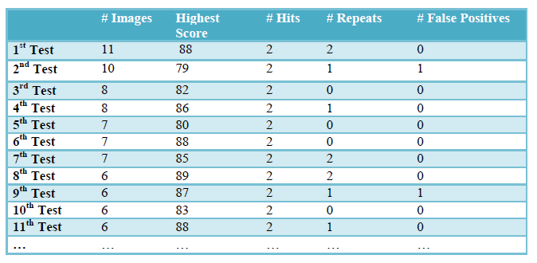

Face recognition needs to be advanced to overcome instabilities due to variable illuminations, face expressions, poses and occlusion. 150 face images from 89 individuals have been used to train face the recognition algorithm and testing the system\`s performance. Most of the images in the database are not sufficiently annotated with the exact illumination angle, face expressions, pose angle, and illuminant color. We carried out tests which included images in the database being matched with probe images from several individuals in different and exact capture environments. In the table above, we report the experimental results of face recognition performed using correlation matching and principal component analysis under various environmental conditions.

**Conclusion**

Face recognition is a security measure in the field of computer vision, image analysis and pattern matching that is rather challenging to implement in systems to heighten system security and to curb unauthorized access. It has drawn much attention over the last few years because of its promising security features and its ability to be applied in various domains such as ID systems, voting systems, Automatic Teller Machines just to mention a few. Past research in this field over the last few years have shown good progress and the results obtained so far shows that current facial recognition systems have reached acceptable and reasonable security threshold value while under operation in dynamic conditions and environments.

ATM access control has clearly shown that there exists a robust security specification that standardizes authentication in ATM machines. However, there are still a range of problems and pitfalls in identification and access control. We have keenly looked at the various security mechanisms of authentication available for identification and access control. We have analyzed passwords, PINs, smartcards and biometrics for their strengths and weaknesses. It is very important to have a strong non-intrusive access control mechanism to ensure that computerized resources are secure from unauthorized users. We have also looked at ease/difficulty of compromising these mechanisms and their cost of implementation. Future research should critically look at ethical hacking to expose other weaknesses of these access control mechanism.

**REFERNCES**

*1. A. Pentland, B. Moghaddam, and T. Starner, Viewbased and modular eigenspaces for face recognition, in IEEE Conference on Computer Vision and Pattern Recognition, 1994.*

*2. Belhumeur, P.N. ; Hespanha, J.P. & Kriegman, D.J. (1997). Eigenfaces vs. Fisherfaces: Recognition Using Class Specific Linear Projection, IEEE Transactions (PAMI)*

*3. Blanz, V., Romdhani, S., Vetter, T. Face Identification across Different Poses Chris Skinner, 2010.*

*4. David W. Embley, Bernhard Thalheim(Eds.): Handbook of Conceptual Modeling, 2011.*

*5. Davies, G., Ellis, H., and Shepherd, J. (1977) Cue saliency in faces as assessed by the 'Photofit' technique.*

*6. Dimitri PISSARENKO, Eigenface-based facial recognition December 1, 2002 Donglin Liang, 1997. A Survey on ATM Security.*

*7. Fraser, I. H., Craig, G. L., and Parker, D. M. (1990) Reaction time measures of feature saliency in schematic faces.*

*8. Guthery S. and Jurgensen T.M. (2001): “Smartcard developer’s kit”, Macmillan technical publishing. ISBN 1-57870-027-2.*

*9. Handbook of Face Recognition by Stan Z. Li Anil K. Jain.*

*10. He, Y.; Zhao, L. & Zou, C. (2006). Face recognition using common faces method, Pattern Recognition.*

*11. Heseltine, “Face Recognition:Two-Dimensional and Three-Dimensional Techniques” September 2005*

*12. Jeff Johnson and Austin Henderson: Conceptual Models in a Nutshell , 2013*

*13. John D. Woodward, Jr., Christopher Horn, Julius Gatune, Aryn Thomas, “Biometrics, A Look at Facial Recognition,” RAND, 2003.*

*14. Kyungnam Kim, “Face Recognition using Principle Component Analysis”, Department of Computer Science, University of Maryland, College Park, USA,1990*

*15. L. Sirovich and M. Kirby, "A Low-Dimensional Procedure for the Characterization of Human Faces," J. Optical Soc. Am. A, 1987,*

*16. Lindsay I Smith, A tutorial on Principal Components Analysis, February 26, 2002.*

*17. M. Yang, D. J. Kriegman, and N. Ahuja, "Detecting Face in Images: A Survey", IEEE Trans. on PAMI, Vol. 24, No. 1, pp. 3458, Jan. 2002.*

*18. Matthew A. Turk, Alex P. Pentland, Face Recognition Using Eigenfaces, Proc. IEEE Conference on Computer Vision and Pattern Recognition: 586–591. 1991.*

*19. Michael Kraus, Face the facts: facial recognition technology's troubled past--and troubling future, The Free Library, 2002.*

*20. Moses MICHIRA, 2014. New crimes study in Kenya on Automatic Face and Gender Recognition, 2002.*

*21. R. Brunelli, T. Poggio. Face Recognition through Geometrical Features. Proceedings ECCV92, 1992*
